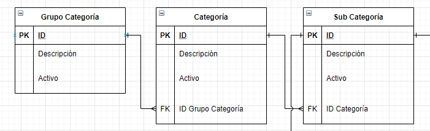
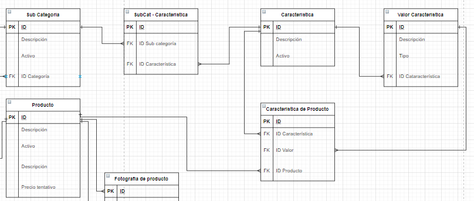
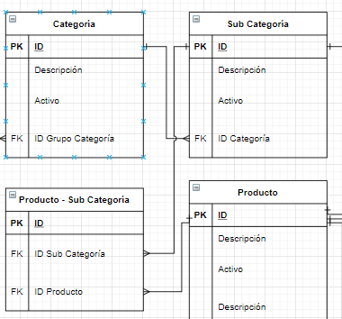
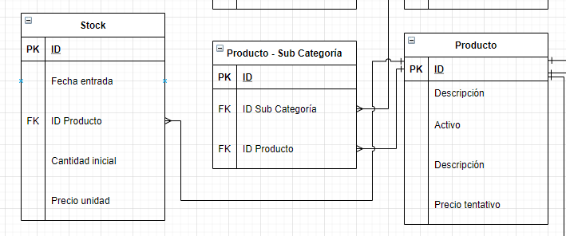
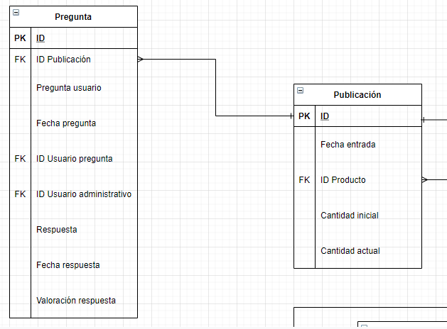
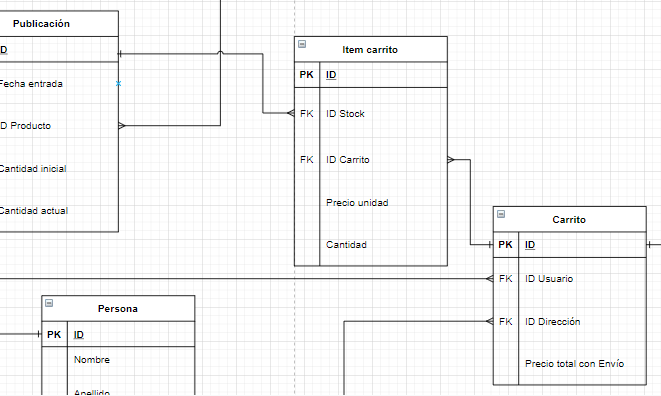
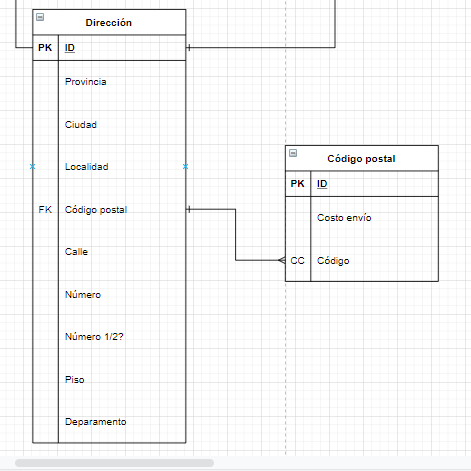

# Comentarios sobre el modelo de datos

Se propone hacer un buscador, capaz de buscar por nombre, por una serie de categorías y por una serie de características que pueden tener los productos.

Para esto, se diseñaron 3 niveles de categorías.

Además agregamos características para agregar formas de búsqueda. Las cuales pueden ser asignadas a las sub categorías. Luego, cada producto podrá tener un valor de una serie predefinido para cada característica asociada a su sub categoría.

Cada producto puede tener varias sub categorías.

Un ejemplo que vimos en páginas que está en producción como Mercado Libre o Tienda Mía, es que tienen un anidamiento de categorías. A continuación un ejemplo de como quedaría en nuestro sistema:

* Producto: Motherboard Asus X570

* Grupo de categoría: Informática.
  
* Categoría: Componente PC.

* Sub-Categoría: Motherboard.

* Característica 1: Socket => AM4

* Característica 2: Tipo RAM => DDR4

* Característica N: Cantidad de pines para procesador => 8

Por lo que se quiere lograr que un usuario pueda buscar este producto escribiendo palabras claves. Como por ejemplo: `Componente PC AM4`.

Se tiene un recuento del stock de los productos.

Los productos pueden publicarse. Luego, cada publicación tendrá una cantidad máxima de unidades para vender que será menor al stock actual.
Las publicaciones pueden tener preguntas de `usuarios externos` y ser respondidas por `usuarios administrativos`.

Se propone la entidad `Carrito` para poder comprar varias cosas a la vez.
Se asocia al carrito con una dirección, para agregar el valor del envío al costo.

Se tiene una entidad con costos por código postal. ¿Se podrá reemplazar con alguna API?

Se diseñaron las entidades de venta para tener separadas los intentos de compras, las compras pagadas y las compras ya enviadas.

