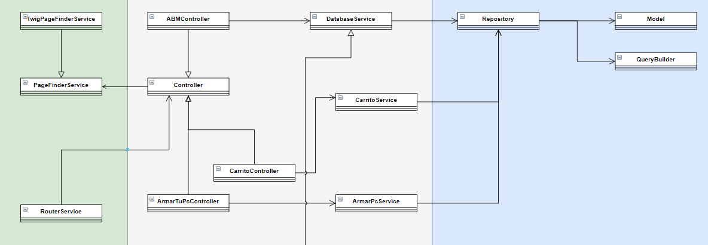

# Diagrama de clases

A continuación se indican las clases que consideramos más importantes.
Las de la zona verde son parte de la vista, las de la gris, son parte del controlador y las de la azul son parte del modelo.
Según el modelo MVC.

