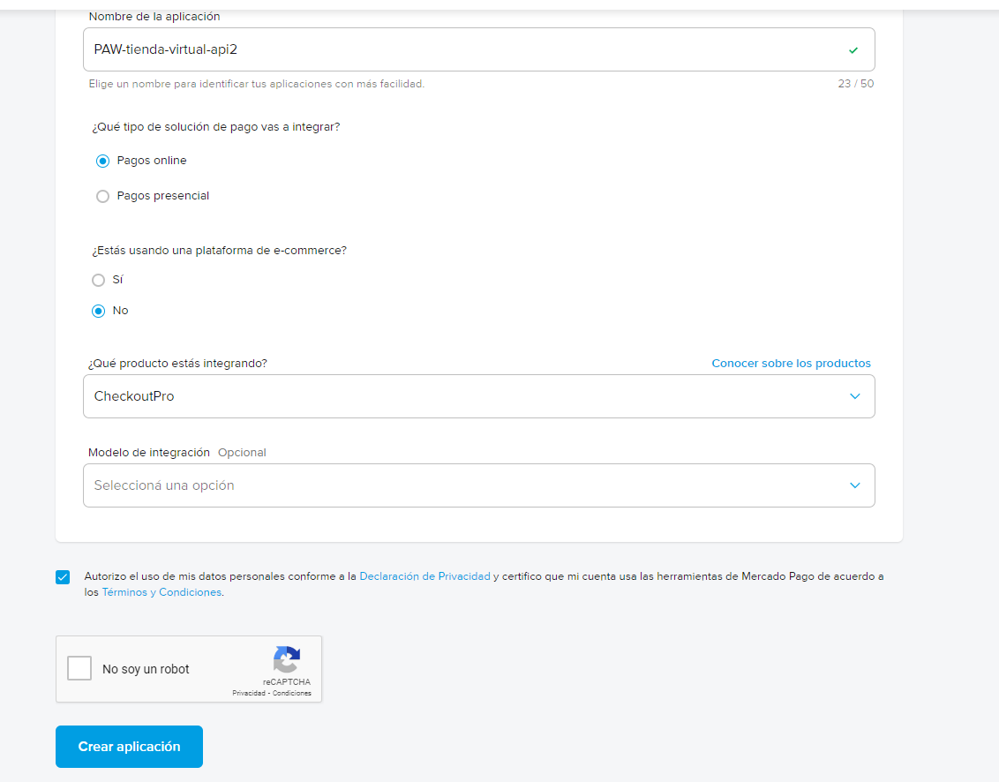
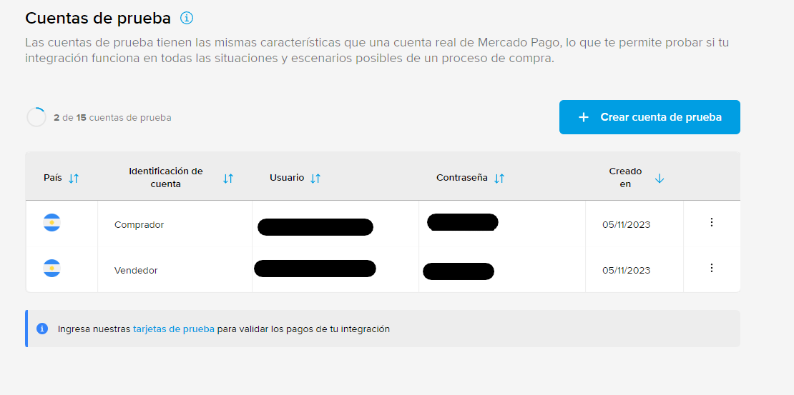
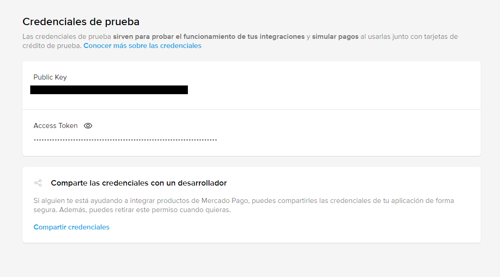
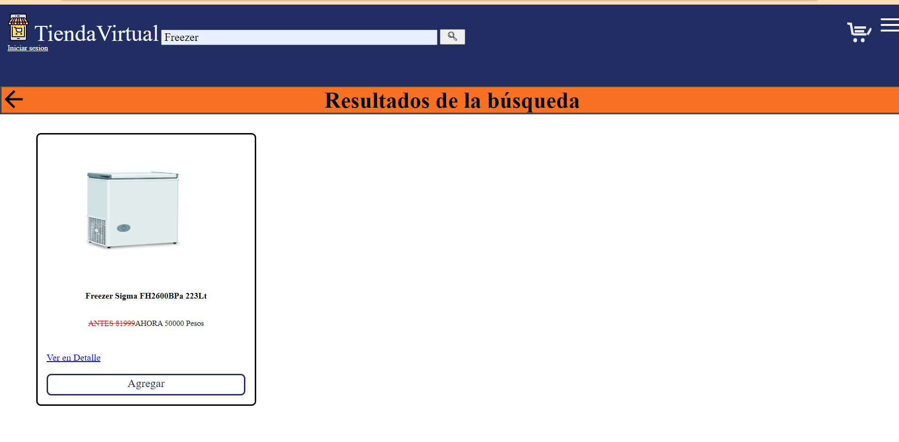
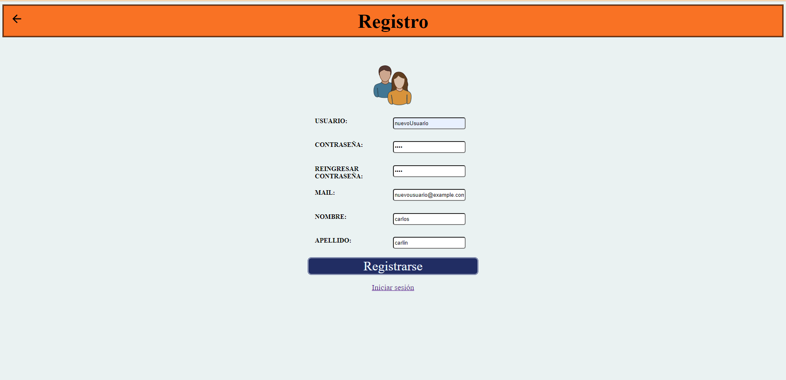
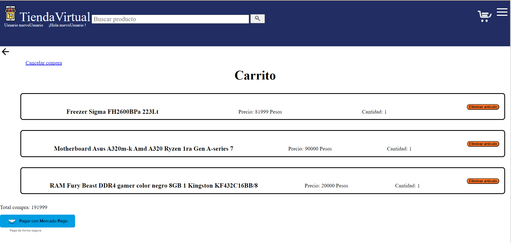
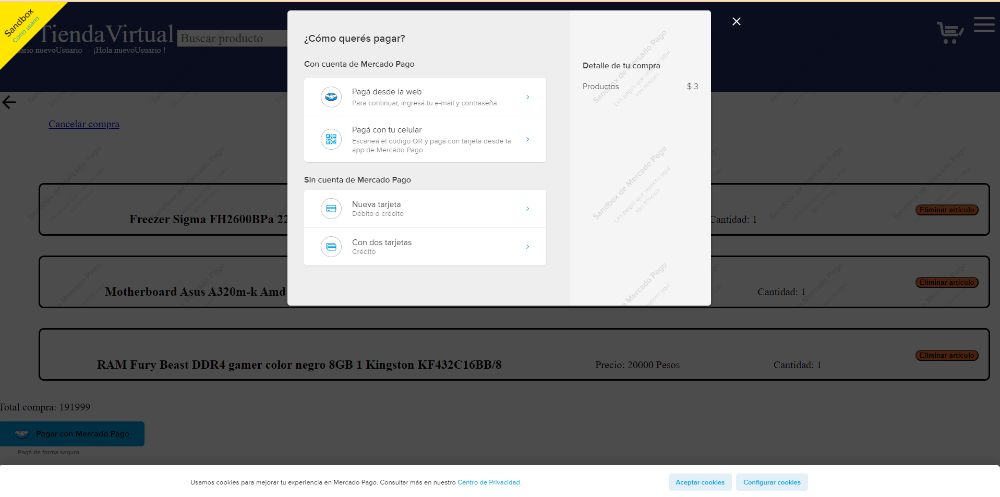

# PAW TP Integrador

## Descripción

Se requiere elaborar una aplicación web como trabajo final para la asignatura Programación en Ambientes Web, código 11086, de la carrera Licenciatura en Sistemas de Información, de la Universidad Nacional de Luján.

Alumnos:
- Nicolás Larena
- Delfina Morello


Se ha desarrollado una tienda virtual, en la cual se pueda buscar productos, agregarlos a un "carrito", poder comprarlos y poder ver las compras realizadas.

Además, se puede hacer búsquedas a través de un sistema de categorías y filtrar por productos en ofertas.

También, se diferencia entre usuarios no logeados, usuarios logeados y usuario admin.
Los usuarios no logeados no pueden acceder a ciertas funcionalidades, y los usuarios admin pueden acceder a funcionalidades de gestión.

Se puede probar en el [servidor publicado](https://paw-tienda-virtual.azurewebsites.net).

## Wireframes

[Website wireframes](https://drive.google.com/file/d/1tXy-hiiiXWPhsxC8GGx9olDPqJKver_g/view?usp=drive_link)


[Link secundario](https://www.figma.com/file/FgawfllMkwyFLRsrzFRfwW/Untitled?node-id=0%3A1)

## Modelo de datos

[DER en draw.io](https://drive.google.com/file/d/1mYB9B2K3Yq20m6xe4iRQhX1s6F8JGkS-/view?usp=sharing)

[Comentarios DER](/Documentación/DER.md)


## Instalación

- Instalar PHP.
- Instalar [Composer](https://getcomposer.org/).
- Configurar php.ini
  - Descomentar los valores:
    - Curl y ssl son necesario para la API de Mercado Pago.
    - Se usa una base de datos MySql.
```
    extension=curl
    extension=openssl
    extension=pdo_mysql
```
  - Se requiere configurar [certificados](https://curl.se/docs/caextract.html).
    - Se descargan, se pegan en alguna carpeta del servidor donde se tenga permisos y se modifica el php.ini. Se requieren modificar dos valores:
```
    curl.cainfo ="C:/cacert.pem"
    openssl.cafile="C:/cacert.pem"
```
- Una vez instalados todos los requerimientos, desde el fichero raíz de este proyecto, se ejecuta en una consola:
```
    composer install
```

### Configuración de la base de datos

Para migrar la base de datos hay que configurar o crear el archivo .env que está ubicado en la raíz de este proyecto.
Se deben configurar las siguientes variables:
- DB_HOSTNAME (IP o URL del host)
- DB_DBNAME (Nombre de la base de datos a utilizar)
- DB_USERNAME (Nombre de usuario)
- DB_PASSWORD (Contraseña)
- DB_PORT (Puerto)
- DB_CHARSET (Codificación de caracteres)

Luego, se puede realizar la migración con el siguiente comando:

Windows:
```
    vendor/bin/phinx migrate -e development
```
Linux:
```
    phinx migrate -e development
```

### Configuración Mercado Pago

Se ingresa al sitio de [Mercado Pago developers](https://www.mercadopago.com.ar/developers/es), requiere logearse.
Desde el [panel de integraciones](https://www.mercadopago.com.ar/developers/panel/app) se crea una nueva aplicación.



Se ingresa el nombre de la aplicación, que es para hacer pagos online y se usa el producto Checkout PRO.


Se va a cuentas de pruebas desde el menú lateral.

Y se crean dos cuentas, una de vendedor y otra de comprador.



Desde otro navegador, se logea en Mercado Pago con las credenciales de la cuenta del vendedor de prueba.
Y se vuelve a crear otra APP.

Una vez creada otra APP desde la cuenta del vendedor, desde el panel lateral se va a Credenciales de prueba.



La public key, se debe ingresar en el archivo [carrrito.twig](src/tienda_virtual/views/twig/carrito.twig).
Línea 47.

Y el access token debe ingresarse en el archivo .env como valor de la variable
```
    MERCADO_PAGO_ACCESS_TOKEN = token
```

Una vez configurada la aplicación, puede ejecutarse de forma local con el comando:

```
    php -S localhost:8080 -t public
```


## Usos y funcionalidad de la aplicación

Una vez corriendo la aplicación, deberá poder ver una vista similar a la siguiente:


Con la caja de texto ubicada en la parte superior de la pantalla, se puede ingresar un texto para realizar una búsqueda.



Se puede buscar productos, ver ofertas o el home sin logearse, pero para las demás funcionalidades se requiere crear una cuenta.
Con el botón "agregar" que se ve para cada producto, se intenta agregar un producto al carrito.
Si se intenta agregar un producto sin logearse, se redireccionará al login. Y desde el login se puede crear un nuevo usuario.

La vista de registro es similar a la siguiente.



Hay ciertas validaciones, como caracteres para el nombre de usuario, que el mail respete una expresión regular. Todo esto se valida en los archivos:
- Para el front por [HTML](/src/tienda_virtual/views/twig/registrarse.twig).
- Desde el back desde la clase [LoginController](/src/tienda_virtual/controllers/LoginController.php).

Para guardar el usuario se usa la tabla ```usuario```, y en el campo ```password``` se guarda un hash de la contraseña que ingresa el usuario.

Una vez creado el usuario, se puede logear con el nuevo usuario. Un detalle importante, es que la contraseña se hashea en la clase [UserModel](/src/tienda_virtual/database/models/UserModel.php) en el método ```setPassword``` con la función ```password_hash($password, PASSWORD_BCRYPT, [cost' => 12])```.

Como nota personal, comento que quizás este comportamiento de hasheo debería sacarse a la clase [UserService](/src/tienda_virtual/services/UserService.php), ya que el patrón service indica que toda la lógica de negocio debería estar en las clases de servicio.

Una vez logeado, se podrá agregar productos al carrito y comprarlos.
Cuando se agregue un producto al carrito o se clickie el símbolo de carrito, se direccionará a una vista similar a la siguiente.



Al hacer click en pagar, se abrirá un popup que se integró de la API de Mercado Pago.



Para pagar se recomienda ingresar con las credenciales del segundo usuario de prueba. Sin embargo, se alteró el precio de los productos a 1 peso para facilitar las pruebas. Ya que al crear la cuenta, se indica el monto de dinero ficticio que se tiene en ella.
Se indica el precio, y la lista de los productos en la clase [MercadoPagoHandlerController](/src/tienda_virtual/controllers/MercadoPagoHandlerController.php).
Una oportunidad de mejora, es encapsular el comportamiento en una clase de servicios.

Una vez se complete la compra, se podrá ver el listado de compra hechas en la sección de mis compras.
A la cual se puede ingresar desde el menú que se despliega desde el ícono en la parte superior izquierda.

